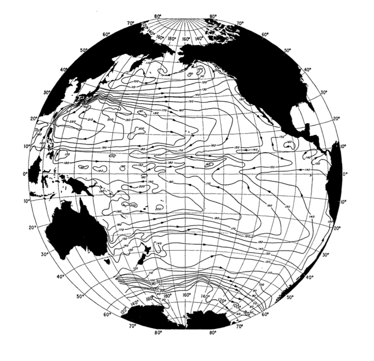
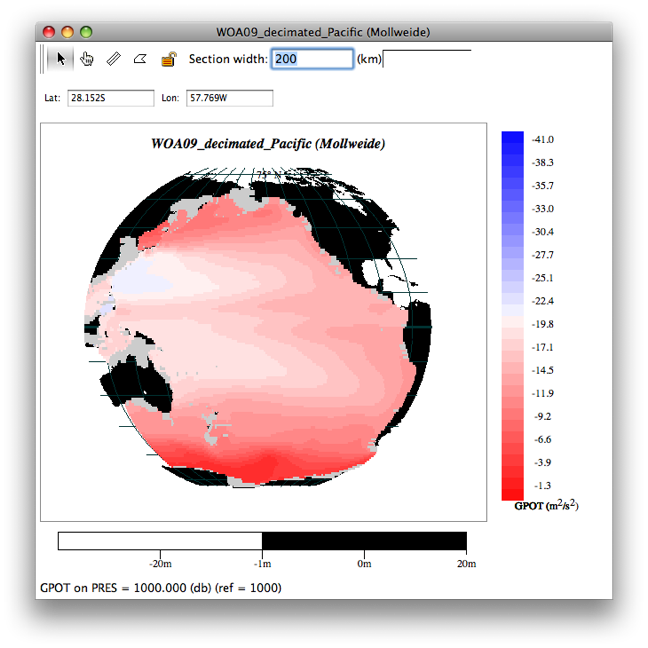

Example 7B: Dynamic Topography Maps
===================================
DPO Chapter 7 (website supplement) includes this map of the dynamic topography of Pacific Ocean, 0/1000 decibars (Figure S7.21).

  Fig 7b-01 dynamic topography of Pacific Ocean, 0/1000 decibars

We will next use JOA to make a similar map from a custom subset of the WOA05 data set. This data set was made with somewhat reduced grid resolution (= larger grid size) in order to make a smaller data set that will work well with more computers.

Files that may be needed or created in this example:

* WOA09_decimated_Pacific.joa
* WOA09_heavydeci_Pacific.joa

Exercise 7B-01: Making a Dynamic Topography Map
-----------------------------------------------
* Start JOA
* **File → Open…** → WOA09_decimated_Pacific.joa

  .. note::
    If your computer cannot handle the large WOA05_decimated_Pacific.joa file, then try using the smaller WOA09_heavydeci_Pacific.joa data file instead.

* **Calculations → Parameters…**
* From the **Parameter Calculations** dialog box select **Geopotential anomaly** and click **OK**

  .. figure:: figures/fig7b-02.png

    Fig 7b-02 Parameter Calculations dialog box

* **Plots → Map…**
* Set up a whole-Pacific **Mollweide-projection** map plot as follows:

  .. figure:: figures/fig7b-03.png

    Fig 7b-03 General Settings tab of Configure Map Plot dialog box

* Use the **Bathymetry** tab of the **Configure Map Plot** dialog box to select the etopo20.nc bathymetry file and use the Colorbar “ROSE-black_cbr.xml” (like with other map plots where the stations are in a grid covering the map)
* Select the **Iso-surface value** sub-panel of the **Station Colors** tab to make an **Iso-surface value** plot of **GPOT** referenced to 1000 decibars:

  * Choose **GPOT** under **Parameter**:
  * Use PRES-0-1000_srf.xml for **Surface**:
  * We have made a custom color bar for GPOT. To do this:

    * Choose the **Blue-White_Red-32** color palette
    * Click on the linear ramp **Create autoscale colorbar** choice (the left-most one)
    * Double-click on the default autoscale color bar to bring up the **Colorbar Editor** dialog box
    * Enter **-41** for the **Start value**: and **0** for the **End value**: and click the linear (left-most) **Create with shape**: choice
    * Click OK to return to the Configure Map Plot dialog box

    .. figure:: figures/fig7b-04.png

      Fig 7b-04 Colorbar Editor

  * In the **Surface Value** section of the **Configure Map Plot** dialog box:

    * Enter **Initial surface value**: as **1000**
    * Select **Reference Level**: and enter **PRES = 1000**

    .. figure:: figures/fig7b-05.png

      Fig 7b-05 Iso-Surface value tab of Station Colors tab of Configure Map Plot dialog box

* Click **Plot** to get this map, which is similar to the DPO Chapter 7 map of the dynamic topography of the Pacific Ocean, 0/1000 decibars:

  Fig 7b-06 dynamic topography of Pacific Ocean, 0/1000 decibars

Using this technique, you can now map dynamic topography for other ocean regions.

.. admonition:: Examine
  :class: tip

  Note that by generating custom color bars, and by cycling the map to different pressures with the "up" and "down" arrow keys on your keyboard, and by using different choices of reference level in the map plot dialog box, you can explore many aspects of the relative circulation of the oceans.