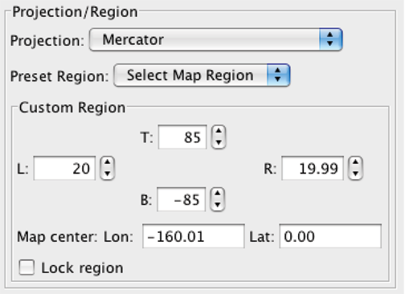

Example 9-14B: Introduction to JOA Maps
=======================================
Your work with data for each ocean region will likely involve working with JOA maps. It is not difficult to edit the region covered by a JOA map to obtain a map covering only the region of immediate interest.

For example, when you set up a map plot in JOA with the **Configure Map Plot** dialog box, **after** you choose a Projection you can choose a preconfigured Preset Region from the 'Select Map Region' list:

  Fig 9b-01 Projection/Region section of the Configure Map Plot dialog box

It is also easy to set up a new map or revise an existing one via the 'Custom Region' choices.

.. note::
  Remember that JOA uses negative latitudes for “south” latitudes and negative longitudes for “west” longitudes.

We supply below some suggestions for Custom Region entries for whole-basin map plots. The maps will include principal marginal seas as well as the main basins. The table lists the source, region, and names of the data files, along with suggested **B**\ ottom, **T**\ op, **L**\ eft, and **R**\ ight JOA 'custom region' map boundaries for each.

+----------------+-----------------------+---------------------------------+---------------------------------------+--------------------------------------------+
|     Source     |  WOA09 (undecimated)  |    WOA09 (lightly decimated)    |       WOA98 (heavily decimated)       | Suggested JOA custom region map boundaries |
+================+=======================+=================================+=======================================+==========+==========+===========+==========+
|  Ocean Region  |                       |                                 |                                       |  **B**   |  **T**   |  **L**    | **R**    |
+----------------+-----------------------+---------------------------------+---------------------------------------+----------+----------+-----------+----------+
| North Atlantic | WOA09_N_Atlantic.joa  | WOA09_N_Atlantic_decimated.joa  |                                       | 0        | 80       | -100      | 30       |
+----------------+-----------------------+---------------------------------+---------------------------------------+----------+----------+-----------+----------+
| South Atlantic | WOA09_S_Atlantic.joa  | WOA09_S_Atlantic_decimated.joa  |                                       | -80      | 0        | -80       | 30       |
+----------------+-----------------------+---------------------------------+---------------------------------------+----------+----------+-----------+----------+
| Atlantic       | WOA09_Atlantic.joa    | WOA09_Atlantic_decimated.joa    | WOA98_heavy_decimated_Atlantic.poa    | -80      | 80       | -100      | 30       |
+----------------+-----------------------+---------------------------------+---------------------------------------+----------+----------+-----------+----------+
| Indian         | WOA09_Indian.joa      | WOA09_Indian_decimated.joa      | WOA98_heavy_decimated_Indian.poa      | -75      | 30       | 15        | 130      |
+----------------+-----------------------+---------------------------------+---------------------------------------+----------+----------+-----------+----------+
| North Pacific  | WOA09_N_Pacific.joa   | WOA09_N_Pacific_decimated.joa   |                                       | 0        | 70       | 100       | -75      |
+----------------+-----------------------+---------------------------------+---------------------------------------+----------+----------+-----------+----------+
| South Pacific  | WOA09_S_Pacific.joa   | WOA09_S_Pacific_decimated.joa   |                                       | -80      | 0        | 120       | -60      |
+----------------+-----------------------+---------------------------------+---------------------------------------+----------+----------+-----------+----------+
| Pacific        | WOA09_Pacific.joa     | WOA09_Pacific_decimated.joa     | WOA98_heavy_decimated_Pacific.poa     | -80      | 70       | 100       | -60      |
+----------------+-----------------------+---------------------------------+---------------------------------------+----------+----------+-----------+----------+
| Arctic-1       | WOA09_Arctic_1.joa    | WOA09_Arctic_1_decimated.joa    | WOA98_heavy_decimated_Arctic.poa      | 50       | 90       | -180      | 180      |
+----------------+-----------------------+---------------------------------+---------------------------------------+----------+----------+-----------+----------+
| Arctic-2       | WOA09_Arctic_2.joa    | WOA09_Arctic_2_decimated.joa    |                                       | 65       | 90       | -180      | 180      |
+----------------+-----------------------+---------------------------------+---------------------------------------+----------+----------+-----------+----------+
| Southern       | WOA09_Southern.joa    | WOA09_Southern_decimated.joa    | WOA98_heavy_decimated_Southern.poa    | -90      | -30      | -180      | 180      |
+----------------+-----------------------+---------------------------------+---------------------------------------+----------+----------+-----------+----------+
| Antarctic      | WOA09_Antarctic.joa   | WOA09_Antarctic_decimated.joa   |                                       | -90      | -60      | -180      | 180      |
+----------------+-----------------------+---------------------------------+---------------------------------------+----------+----------+-----------+----------+
| World Ocean    | WOA09_World_Ocean.joa | WOA09_World_Ocean_decimated.joa | WOA98_heavy_decimated_World_Ocean.poa | -80      | 80       | 20        | 19.9     |
+----------------+-----------------------+---------------------------------+---------------------------------------+----------+----------+-----------+----------+

.. note::
  For the Arctic and Southern region map plots, use the appropriate polar map projections, i.e. “North Pole” or “South Pole”. “Arctic-1” includes waters of the Bering Sea, and “Arctic-2” covers the Arctic Ocean and some of the Nordic Seas.

  For the World Ocean map plots, in the 2008 version of JOA one is restricted to use either the Mercator or Miller projections only

  The custom region map boundaries which cover the largest areas (e.g., all-Pacific and all-Atlantic) work better with some Map Projections than others. The “Mollweide” projection in particular often works well.

.. hint::
  In Java OceanAtlas, you can 'open' one data file and then 'add' another to it, in order to make data files that combine or bridge these data sets.