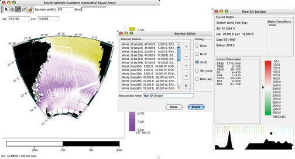
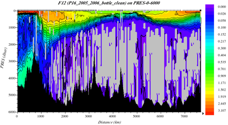
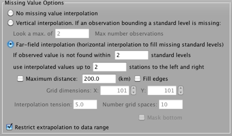
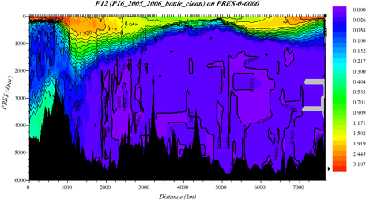

Example 9-14D: Using Data Subsets & Advanced JOA Tools
======================================================
The following exercises are an application of the techniques from Example Intro-C. We will be using the WOA09 file associated with the Atlantic Ocean, but the exercises can be repeated using any basin.

Files that may be needed or created in this example:

* WOA05_atlantic.jos

Exercise IntroD-01: Map Plots - Using Data Subsets
--------------------------------------------------
Continue from IntroC-01:

Below is an example of creating a new Java OceanAtlas section from a South Atlantic gridded data map plot:

  Fig 9d-01 A layout of a Map Plot, Section Editor and Data Window

To make this particular example:

* Choose the **Section Selection Tool**

  * Drag-click from South American to Africa along a three segment user-defined path
  * Double-click at the end of the third segment to end section selection

* In the **Section Editor** dialog box

  * select **W→E** sorting
  * Click **Sort** button
  * Click **Create**
  * A new **Data Window** displays (right image)

The exact results will depend on the path chosen and the Section width setting in effect when the section selection tool was selected on the map plot. Wider section widths will pick up more stations along the path.

.. note::
  Java OceanAtlas is using the center of each station symbol, not the full size of enlarged symbols. The section tool takes a bit of practice to use, the feel of which may be affected by the mouse (or equivalent) settings for your particular computer.

Exercise IntroD-02: Using Far-Field Interpolation to Enhance Contour Plots Made From Sparse Data
------------------------------------------------------------------------------------------------
Typically, JOA vertical section data from oceanographic research cruises have some parameters (such as CFCs, helium, tritium) available at only relatively sparse horizontal resolution compared to the underlying temperature, salinity, oxygen, and nutrient profile data (parameters whose measurement is sometimes collectively known as "routine hydrography"). When contouring data in a default JOA Contour plot, JOA uses a vertical interpolation scheme based on all the water samples in the vertical at each station, and the closest samples horizontally. So when making a Contour plot of a horizontally sparsely-sampled parameter - for example, CFCs are often sampled in deep Pacific Ocean waters at only every second or third station - JOA frequently runs into what it perceives as missing data, leaving many parts of the resulting contoured vertical section blank.

For example, below is a plot of CFC-12 made from the "P16_clean_bottle.joa" data set with the default JOA "vertical interpolation" choice for "missing value options" (usually the default setting in a copy of JOA) and a custom color bar generated to highlight low CFC-12 data values:

  Fig 9d-02 CFC Contour Plot

But this plot can be made more appealing if JOA is set to look horizontally past stations missing data for the parameter being contoured - what is called "far field interpolation" in JOA. Thus, when setting up the Contour plot in such a situation, after selecting a "Parameter" to contour and a choice from "Interpolation surfaces" onto which to interpolate the parameter to be contoured, select the Interpolations Options button, which brings up the Interpolations Options dialog box, from which you can select "far field" interpolation, as in this example:

  Fig 9d-03 Interpolations Options dialog box

Now, when the CFC-12 Contour Plot is redrawn (using the same data set, interpolation surface, and custom color/contour bar as previously), the deep water CFC-12 field is much more readily visualized:

  Fig 9d-04 CFC Contour plot with far field interpolation

The far field interpolation technique is not needed when making vertical sections from WOA data, because the WOA data have been interpolated onto all of the grid points. But many of the ocean vertical section data from research cruises used in the DPO Examples are more sparsely sampled laterally in some parameters than others, in which case JOA far-field interpolations can be useful for making contour sections of the sparsely sampled parameters, as they were in this example.

Reminder: the Interpolation Options button in the Contour Plot dialog box is activated only after first selecting a "Parameter" to contour and also a choice from "Interpolation surfaces" onto which to interpolate the parameter to be contoured.