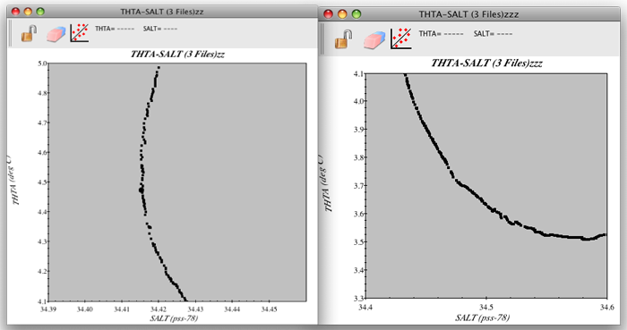

Example S6B: A Vertical Profile Visualized from CTD, Bottle, and Multi-year Averaged Data
=========================================================================================
Files that may be needed or created in this example:

* A16S_2005_sta085_bottle.joa
* A16S_2005_sta085_ctd.joa
* WOA05_to_match_A16S_2005_sta085.joa

We have made a few minor alterations to parameter names in some of these data files to make comparisons easier, but, otherwise, these are the actual data files used in research.

Exercise S6B-01: Comparing Data - Opening Multiple Files in a JOA Window
------------------------------------------------------------------------
Open three files into the same JOA data window:

* Start JOA
* **File → Open…** → A16S_2005_sta085_bottle.joa
* **File → Add Data** → A16S_2005_sta085_ctd.joa
* **File → Add Data** → WOA05_to_match_A16S_2005_sta085.joa
* **Calculations → Parameters…**
* Select (click) under **Observation calculations**:
  * **Theta (Deg. C)**
  * **Sigma 0 (kg/m^2)** (This is the same parameter as 'sigma-theta' as used in the DPO text)
  * **Sigma 4 (kg/m^2)**

  .. figure:: figures/figs16b-01.png

    FIG s6b-01 Parameter Calculations dialog box

  .. note::
    Recall from the DPO text and earlier DPO JOA Examples: sigma-0 is density at sea surface pressure, minus 1000, and sigma-4 is density at 4000 decibars, minus 1000.

* Click **OK**

The common parameters to all three data files, including those we have just calculated, are:

* Pressure
* Temperature
* Salinity
* Dissolved oxygen
* Potential temperature
* sigma-0
* sigma-4

Exercise S6B-02: Comparing Data - Plotting Multiple Parameters Against Pressure
-------------------------------------------------------------------------------
Use JOA plot tools to create separate plots for each property against pressure.

* **Plots → Property-Property…**
* Under **X-axis parameter** select **SALT**
* Under **Y-axis parameter** select **PRES**
* Under **Options** select:

  * **Plot current station only**
  * **Plot symbols are black**

  .. figure:: figures/figs16b-02.png

    FIG s6b-02 Basic panel of the Property-Property Plot

* Click **Plot**
* Following the previous steps, make another Property-property Plot, this time under **Options** select:
  
  * **Plot all stations** (do not select Plot current station only)

* The two plots are shown below, the first on the left and the plot on the right showing the profiles from all three data files

  .. figure:: figures/figs16b-03.png

    FIG s6b-03 Property-Property Plots

* Follow these steps again, each time changing the **X-axis parameter** to:

  * Potential temperature
  * Dissolved oxygen
  * Sigma-0
  * Sigma-4

  .. note::
    You can shift between the data files using the left and right arrow keys on your keyboard. This way, you can separately view the plot for each data file on the left, Plot current station only plot.

Use JOA's select-redraw feature to examine sub-areas of each of these plots. This way you can enlarge portions of the water column, for example the upper few hundred meters and the regions around extrema:

* Click-drag-release the cursor over a sub-area of a JOA Property-Property Plot

.. admonition:: Examine
  :class: tip

  Consider why these three profiles do not completely overlap.

  * Small disagreements between the WOA05 profile and the A16_2005 profile certainly can arise due to the averaging-in of other data when the WOA was created. (Plus, the WOA05 grid point is about 50 km from the A16 station location.) But the CTD data and bottle data profiles are from the same station on the 2005 “A16” cruise from the NOAA research vessel Ron Brown.
  * Differences between temperature between the A16 bottle data and CTD data can arise because the CTD data are from the “down” cast and the bottle data are from the “up” cast - this is partly die to the effects of internal waves in the ocean, plus drift of the ship, plus lateral motions of various layers of the water column.
  * The salinity and oxygen values in the bottle data file are from water samples, whereas the values in the CTD data file are from electronic sensors. The electronic sensor data are corrected/calibrated against the bottle data, but perfect fits are not reasonable.

Exercise S6B-03: Comparing Data - Potential Temperature Versus Salinity in CTD Data
-----------------------------------------------------------------------------------
It is useful to examine a potential temperature versus salinity plot for the CTD data in particular.

* **Plots → Property-Property…**
* Set up the **Basic** panel of the **Property-Property Plot** dialog box as below:

  .. figure:: figures/figs16b-04.png

    FIG s6b-04 Basic panel of the Property-Property Plot dialog box

* Set up the **Advanced** panel of the **Property-Property Plot** dialog box as shown below:

  .. figure:: figures/figs16b-05.png

    FIG s6b-05 Advanced panel of the Property-Property Plot dialog box

* The resulting plot is shown below:

  .. figure:: figures/figs16b-06.png

    FIG s6b-06 A Property-Property plot

.. admonition:: Examine
  :class: tip

  Do you recognize the shape of the potential temperature versus salinity relationship at this South Atlantic Ocean location?

  Warm salty surface waters overlie a cool, fresher layer (with a salinity minimum), in turn overlying a layer of similar temperature which is saltier (with a salinity maximum), and finally the deepest layer is colder and a little fresher.
  
  Each of these distinctive joint characteristics making up a layer of water is the signature of what oceanographers call a “water mass”.
  
  This plot provides information about this layering of water masses:
  
  Recall that the CTD data file contains one data value for each decibar of pressure, and that JOA is plotting each data point. Therefore each tight clustering of data points on the plot indicates a portion of the profile where temperature and/or salinity are more nearly uniform with pressure, whereas a spreading of data points on the plot will indicate where vertical gradients in one or both are higher.

* Explore this on the plot by repeatedly click-drag-select portions of the plot to the point where you can see individual “1-meter-of-water” dots.

.. admonition:: Examine
  :class: tip

  The dots do cluster and spread. Even on a smaller scale there is some indication that the vertical gradients are not smooth, that there are many “layers”.

  You may also find portions of the water column where there are small “zig-zags” - colder fresher layers interleaved with warmer saltier layers. This shows that CTD data, as compared to bottle data, may show an abundance of small-scale features in the water column (known as “fine structure”), features that are completely missed by the much coarser-resolution bottle or multi-year averaged data.

Here are some examples of enlargements made from this plot:

  FIG s6b-07 Two sample Property-Property plots

