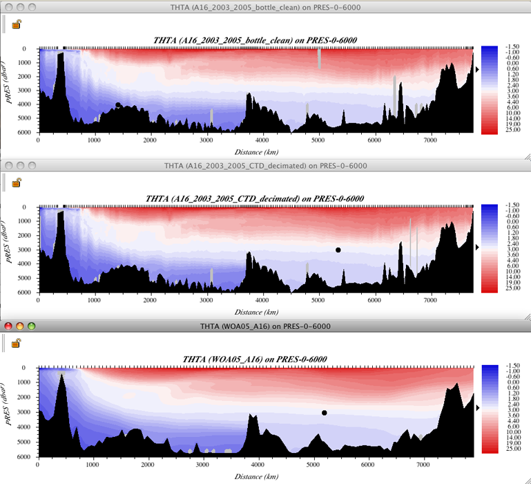

Example S6C: A Vertical Section Visualized from CTD, Bottle, and Multi-year Averaged Data
=========================================================================================
It is worthwhile to compare a vertical section made from three different data types:

* Bottle data
* Decimated CTD data
* Multi-year averaged data

The bottle and CTD data come from the 2003 and 2005 "A16" expeditions for the US Global Ocean Carbon and Repeat Hydrography program, so match up station to station.

The multi-year averaged data come from the World Ocean Atlas 2005 (WOA05) annual average data, which are available at 1-degree intervals of latitude and longitude over the World Ocean - we picked off the data points that are closest to the A16 track.

Files that may be needed or created in this example:

* A16_2003_2005_bottle_clean.joa
* A16_2003_2005_ctd_decimated.joa
* WOA05_A16.joa
* A16_2003_2005_CTD_undecimated.joa

.. note::
  We have changed the parameter names in the CTD data file from CTDS to SALT and from CTDO to O2 to make it easier for you to use the same contour/color bars for plots from all three data sets
  
.. admonition:: Learn More
  :class: seealso

  Decimated CTD data

  A long section of stations, such as the meridional "A16" Antarctic-to-Iceland section, may contain more than 100 profiles (161 in the case of A16). There are typically ca. 24-36 water samples (from water sample bottles) collected during each profile, totaling approximately 5000 water samples.

  Although the Java environment is not an efficient one from the standpoint of use of computer resources, that 5000-sample data volume, typical of a long bottle data section, is not a challenge for most computers using JOA. But the original processed A16 CTD data were reported to the data center at 1 decibar intervals, or about 5000 records per profile, totaling about 800,000 CTD data values for each parameter. That does slow down JOA on the computers available at the time the DPO JOA Examples were written. This alone provides one rationale for using a well-chosen subset of the CTD data for JOA plotting.
  
  Regarding plotting full-resolution CTD data using JOA there are other considerations. For example, on JOA property-property and profile plots (see the JOA Plots menu), the application does show every data value. Therefore on those two plot types, the full resolution of the data can be visualized.
  
  But on JOA contour plots (oceanographers call these vertical section plots), the JOA application grids the data values onto a pre-selected set of surfaces, most often onto a set of pressure surfaces.
  
  At this writing, JOA has an internal hard limit of 128 surfaces per set. Therefore, for example, over the full pressure range of the PRES-0-6000_srf.xml interpolation surface, a maximum of only 128 surfaces could be specified (actually, the number is 64 for that particular interpolation surface), so fine-structure details in the data, which fall between interpolation levels, cannot be shown on a JOA contour (section) plot.
  
  JOA provides via its Preferences window (accessed under the Java OceanAtlas menu), the means for a user to specify if and how CTD data are to be decimated when originally imported into JOA, for example, from the original "WHP Exchange" CTD data format (see https://cchdo.ucsd.edu).
  
  For many uses, it is wise when importing CTD data to use one of the decimation choices. We did this when we prepared the A16S_2003_2005_ctd_decimated.joa data file using a Custom decimation table created by DPO JOA Examples author Swift.

  But if one wishes to explore the full resolution of a CTD data set when importing data, the **No decimation** choice should be selected. We did that when we prepared the A16_2003_2005_ctd_undecimated.joa data file (which is nearly 18-times larger than the decimated version of the same data).

  We note that for some calculations and visualizations, it can be crucial to think through the issue of CTD data decimation. The data set should be imported at a vertical resolution appropriate to the intended interpretation. For example, if you wish to calculate vertical gradients (this is possible via JOA's **Custom Parameter…** dialog box under the **Calculations** menu), you probably want CTD data at equal intervals of pressure, and at an interval size appropriate to your intent.

Exercise S16C-01: Comparing Data - Multiple Data Types (CTD, Bottle, and Multi-year Averaged Data)
--------------------------------------------------------------------------------------------------
* **File → Open…** → A16S_2003_2005_bottle_clean.joa
* **File → Open…** → A16S_2003_2005_ctd_decimated.joa (Do not **Add**)
* **File → Open…** → WOA05_A16.joa (Do not **Add**)

To calculate potential temperature ("theta"), sigma-0, and sigma-4 for each data file:

* **Calculations → Parameters...**
* Select (**theta**), sigma-0, and sigma-4
  
The parameters in common to all three data files are now pressure, temperature, salinity, dissolved oxygen, potential temperature, sigma-0, and sigma-4.

Make contoured vertical sections from each of the three A16-related data files of:

* Potential temperature
* Salinity
* Sigma-0
* Sigma-4
* oxygen

Compare:

* The appearance of the south-to-north and vertical distributions of these parameters when represented by time-averaged bottle-like data, single-expedition bottle data, and single-expedition CTD data.
* The time-averaged versus single-expedition silicate, nitrate, and phosphate data.

We show the three potential temperature sections below.

  FIG s6c-01 Three potential temperature sections

.. admonition:: Examine
  :class: tip

  The sections with an eye to how the different data types represent the distributions of seawater properties.

  The "big picture" is clearly the same in all three data files, but there are clear differences between the visualizations provided by the A16 bottle, A16 CTD, and WOA05 data files.

  But remember, due to the method that JOA uses to plot a contoured vertical section, you cannot see details of smaller vertical extent than allowed by the choice of JOA interpolation surface, so the visual difference between the A16 bottle and CTD vertical sections does not reflect the full difference in resolution of the data files.

.. note::
  On a JOA vertical section ("contour") plot you can select a subset of the plot by click-drag-releasing the mouse.

  The subset of a Contour plot section is a magnification of the same features in the full-range section.

Exercise 6SC-02: High-Resolution Contoured CTD Sections
-------------------------------------------------------
CTD data almost always have significantly greater vertical resolution than do any existing JOA interpolation surfaces, and so you cannot easily visualize the full vertical resolution of CTD data on a JOA Contour (vertical section) plot.

.. note::
  Here we will demonstrate how you can use a custom interpolation surface with levels onto which the data can be interpolated that match or more closely match the vertical resolution of the CTD data. At this writing JOA has a built-in limit of 128 levels per interpolation surface. Therefore, for example, if you wish to plot a contoured section of CTD data with 2-decibar vertical resolution, you will be restricted to a 254-decibar range of pressure, for example you could make a custom interpolation surface to look at the range 960-1214 decibars.

  You can learn more about making custom interpolation surfaces in the JOA User Guide, or simply go to "Surface Manager" under the JOA Resources menu and give it a try.

As an example, we have supplied a custom interpolation surface with 128 levels covering 0-254 decibars at even 2-decibar intervals, which you can use with undecimated CTD data to examine fine structure in the upper layer.

We supply an undecimated CTD data file (A16_2003_2005_clean_CTD_undecimated.joa) for those who wish to take a close look at CTD data near or at the vertical resolution the data were reported to the data center:

* **File → Open…** →A16_2003_2005_CTD_undecimated.joa
* Prepare a contoured/colored vertical section, choosing the "PRES-0-254_srf.xml" interpolation surface, along with whichever parameter to plot - and corresponding color bar - you wish.

  See note below for instructions on easy methods to make temporary custom color/contour bars for JOA Contour vertical section plots.

  .. note::
    Drawing the plot may seriously slow some computers, due to the combination of data file size and computation intensity.

    You may note that the resulting contoured section plot is not all that different in appearance from that of the same pressure range.

* Making a temporary custom color bar for a JOA Contour Plot (vertical section plot) is deliberately made as simple as we could manage, in order that users could most easily explore a data set:

  * Double-clicking on any JOA color bar - one in a dialog box, on any plot, in the Data Window, etc. - will bring up the JOA **Colorbar Editor** dialog box, from which you can set new ranges and/or a new "shape" (interval distribution scheme) for the color bar.

    .. figure:: figures/figs16c-02.png

      FIG s6c-02 The Colorbar Editor dialog box

  * Experimenting with the various "shapes" will help you decide if you want an alternative to the often-best-choice linear shape.
  * The dark gray histogram in the graph-like area of the **Colorbar Editor** dialog box is meant to act as a guide to the relative frequency of occurrence of data inside the overall data range in the Y-axis of the graphic.
  
  (To achieve a custom distribution of color ranges such as the one shown in the above example, you must use the **Contour Manager...** under the JOA Resources menu.)