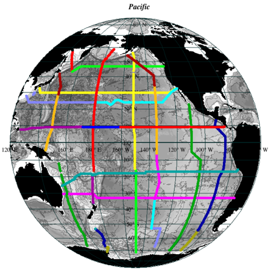

Chapter Ten
===========

Pacific Ocean
-------------

.. admonition:: Data files supplied for Chapter 10 exercises

  * Pacific_sections: →

    * P16_1991_1992: →

      * P16_1991_1992_heavydeci_CTD.joa

    * P14_1992_1996: →

      * P14_1992_1996_clean_bottle.joa
      * P14_1992_1996_clean_CTD.joa

    * P02_2004: →
    
      * P02_2004_clean_bottle.joa

    * P17_1991_1992_1993: →

      * P17_1991_92_93_bottle.joa

    * P10_2005: →

      * P10_2005_clean_bottle_incomplete.joa
      * P10_2005_clean_CTD.joa

    * P16_2005_2006: →

      * P16_2005_2006_bottle_clean.joa
      * P16_2005_2007_heavydeci_CTD.joa
      * P16S_2005_2006_CTD.joa

    * P06_2003: →

      * P06_2003_clean_bottle.joa

    * P18_2007: →

      * P18_2007_clean_bottle.joa
      * P18_2007_clean_CTD.joa

    * P21_1994: →

      * P21_1994_bottle.joa

    * P19_1993: →

      * P19_1993_bottle.joa

    * P03_1985: →

      * P03_1985_bottle.joa

    * P17N_2001: →

      * P17N_2001_clean_bottle.joa

    * P11_1993: →

      * P11_1993_bottle.joa

    * P01_1985_1993: →

      * P01_1985_1993_clean_CTD.joa
      * P01W_1985_1993_clean_bottle.joa

    * P04_1989: →

      * P04_1989_bottle.joa

    * P06_1992: →

      * P06_1992_bottle.joa

    * WOA_copies_of_Pacific_sections: →

      * P02_WOA05.joa
      * P16_WOA09.joa

  * WOA98_heavideci_basin_global_gridded_data: →

    * WOA98_heavydeci_Pacific.poa

  * WOA_decimated_basin_global_gridded_data: →

    * WOA05_decimated_North_Pacific.joa
    * WOA05_decimated_Pacific.joa
    * WOA05_decimated_South_Pacific.joa

  * WOA_basin_global_gridded_data: →

    * WOA05_North_Pacific.joa
    * WOA05_South_Pacific.joa

  Download: :download:`Chapter 10 Data Files <./DPO_data_chapter_10.zip>`

Goals
`````
* Understand the water masses, circulation and other aspects of descriptive physical oceanography of the Pacific Ocean & its marginal seas

To accomplish this, one will:
`````````````````````````````
* Learn to extract data subsets from map plots
* Learn how to use advanced JOA tools for working with basin-scale data sets

Tools
`````
* JOA Section Editor
* Interpolations Options dialog box



  Fig 10i-01 Pacific sections map 

DPO Chapter 10 Sections
```````````````````````

DPO JOA examples are available for the following **emphasized** sections:

.. list-table::
  :widths: 10, 90

  * - **10.1**
    - **Introduction and overview**
  * - **10.2**
    - **Wind and buoyancy forcing**
  * - **10.3**
    - **North Pacific circulation**
  * - **10.3.1**
    - **Subtropical circulation**
  * - **10.3.1.1**
    - **General description**
  * - **10.3.1.2**
    - **The Kuroshio and Kuroshio Extension**
  * - **10.3.1.3**
    - **North Pacific Current and mid-latitude fronts**
  * - **10.3.1.4**
    - **California Current System**
  * - **10.3.1.5**
    - **North Equatorial Current**
  * - **10.3.1.6**
    - **Depth dependence of the subtropical circulation**
  * - **10.3.2**
    - **Subpolar circulation**
  * - **10.3.2.1**
    - **General description**
  * - **10.3.2.2**
    - **Subpolar western boundary currents**
  * - **10.3.2.3**
    - **Circulation in the Gulf of Alaska**
  * - **10.4**
    - **South Pacific circulation**
  * - **10.4.1**
    - **Subtropical circulation**
  * - **10.4.1.1**
    - **East Australian Current**
  * - **10.4.1.2**
    - **South Pacific Current and Subtropical Front**
  * - **10.4.1.3**
    - **Northward flow of the subtropical gyre and the Peru-Chile Current System**
  * - **10.4.1.4**
    - **South Equatorial Current**
  * - 10.5
    - Pacific Ocean mesoscale eddy variability
  * - **10.6**
    - **Depth dependence of the Pacific Ocean circulation and meridional overturn**
  * - **10.7**
    - **Tropical Pacific circulation and water properties**
  * - **10.7.1**
    - **Introduction**
  * - 10.7.2
    - Tropical wind and buoyancy forcing
  * - **10.7.3**
    - **Equatorial Pacific current structure**
  * - **10.7.3.1**
    - **Zonal currents and associated mid-ocean meridional flows**
  * - **10.7.3.2**
    - **Zonal structure of the equatorial currents**
  * - **10.7.3.3**
    - **Equatorial upwelling and biological productivity**
  * - **10.7.4**
    - **Low latitude western boundary currents**
  * - **10.7.5**
    - **Equatorial property distributions**
  * - 10.7.6
    - Intraseasonal and seasonal variability
  * - 10.8
    - El Niño/ La Niña and the Southern Oscillation (ENSO)
  * - 10.8.1
    - El Niño/La Niña description
  * - 10.8.2
    - ENSO mechanisms
  * - **10.9**
    - **Pacific Ocean water masses**
  * - **10.9.1**
    - **Pacific Ocean upper waters**
  * - **10.9.2**
    - **Intermediate waters**
  * - **10.9.2.1**
    - **North Pacific Intermediate Water**
  * - **10.9.1.2**
    - **Antarctic Intermediate Water**
  * - **10.9.3**
    - **Deep waters**
  * - **10.9.4**
    - **Bottom water (Lower Circumpolar Deep Water)**
  * - 10.10
    - Decadal climate variability and climate change