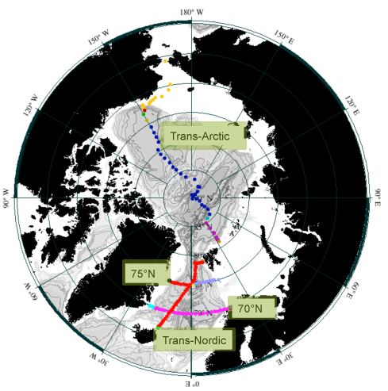

Chapter Twelve
==============

The Arctic Ocean and Nordic Seas
--------------------------------

.. admonition:: Data files supplied for Chapter 12 exercises

  * - Arctic sections: →

    * - Trans_Arctic: →

      * - TransArcticNordic_clean_bottle.joa
      * - TransArcticNordic_clean_CTD.joa

    * - Nordic_70N_2002: →

      * - Nordic2002_70N_clean_bottle.joa

    * - Nordic_75N_2002: →

      * - Nordic2002_75N_clean_bottle.joa

  * - WOA98_heavideci_basin_global_gridded_data: →

    * - WOA98_heavydeci_Arctic.joa

  * - WOA_decimated_basin_global_gridded_data: →

    * - WOA05_decimated_Arctic_1.joa

  * - WOA_basin_global_gridded_data: →

    * - WOA05_Arctic_1.joa

  Download: :download:`Chapter 12 Data Files <./DPO_data_chapter_12.zip>`

Goals
`````
* Understand the water masses, circulation and other aspects of descriptive physical oceanography of the Arctic and Northern Polar Oceans & marginal seas

To accomplish this, one will:
`````````````````````````````
* Learn to extract data subsets from map plots
* Learn how to use advanced JOA tools for working with basin-scale data sets

Tools
`````
* JOA Section Editor
* Interpolations Options dialog box



  Fig 12i-01 Arctic and Northern Polar sections map

DPO Chapter 12 Sections
```````````````````````

DPO JOA examples are available for the following **emphasized** sections:

.. list-table::
  :widths: 10, 90

  * - **12.1**
    - **Introduction**
  * - **12.2**
    - **The Nordic Seas**
  * - **12.2.1**
    - **Nordic Seas circulation**
  * - **12.2.2**
    - **Nordic Seas water masses**
  * - **12.2.3**
    - **Vertical convection in the Nordic Seas and dense water formation**
  * - **12.3**
    - **Baffin Bay and Hudson Bay**
  * - **12.4**
    - **Arctic Ocean: circulation and ice drift**
  * - 12.4.1
    - Ice drift and wind forcing
  * - **12.4.2**
    - **Upper layer circulation**
  * - **12.4.3**
    - **Intermediate and deep circulation**
  * - **12.5**
    - **Arctic Ocean water masses**
  * - **12.5.1**
    - **Surface and near-surface waters**
  * - **12.5.2**
    - **Atlantic Water**
  * - **12.5.3**
    - **Deep and Bottom Water**
  * - **12.6**
    - **Arctic Ocean transports and budgets**
  * - 12.7
    - Sea ice in the Arctic
  * - 12.7.1
    - Distribution of Arctic sea ice
  * - 12.7.2
    - Build-up and break-up of Arctic sea ice; polynyas
  * - 12.7.3
    - Arctic icebergs
  * - **12.8**
    - **Climate variations and the Arctic**