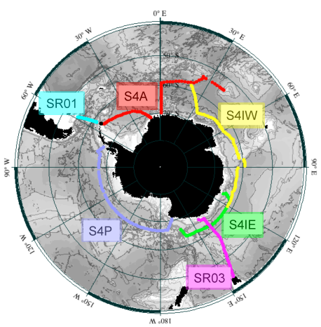

Chapter Thirteen
================

Southern Ocean
--------------

.. admonition:: Data files supplied for Chapter 13 exercises

  * Southern_sections: →

    * READ_ME_RE_SOUTHERN_SECTIONS.txt

  * WOA98_heavideci_basin_global_gridded_data: →

    * WOA98_heavydeci_Antarctic.joa

  * WOA_decimated_basin_global_gridded_data: →

    * WOA05_decimated_Southern.joa

  * WOA_basin_global_gridded_data: →

    * WOA05_Southern.joa

  Download: :download:`Chapter 13 Data Files <./DPO_data_chapter_13.zip>`

Goals
`````
* Understand the water masses, circulation and other aspects of descriptive physical oceanography of the Southern Ocean & its marginal seas

To accomplish this, one will:
`````````````````````````````
* Learn to extract data subsets from map plots
* Learn how to use advanced JOA tools for working with basin-scale data sets

Tools
`````
* JOA Section Editor
* Interpolations Options dialog box



  Fig 13i-01 Arctic and Northern Polar sections map

DPO Chapter 13 Sections
```````````````````````

DPO JOA examples are available for the following **emphasized** sections:

.. list-table::
  :widths: 10, 90

  * - **13.1**
    - **Definition of the Southern Ocean**
  * - 13.2
    - Forcing
  * - **13.3**
    - **Southern Ocean fronts and zones**
  * - **13.3.1**
    - **Fronts**
  * - **13.3.2**
    - **Zones**
  * - **13.4**
    - **Southern Ocean circulation and transports**
  * - **13.4.1**
    - **Antarctic Circumpolar Current**
  * - **13.4.2**
    - **Weddell and Ross Sea gyres**
  * - **13.4.3**
    - **Mid-depth to bottom circulation**
  * - **13.5**
    - **Southern Ocean water masses**
  * - **13.5.1**
    - **Surface Waters**
  * - **13.5.1.1**
    - **Subantarctic Surface Water and Subantarctic Mode Water**
  * - **13.5.1.2**
    - **Antarctic Surface Water**
  * - **13.5.1.3**
    - **Continental Shelf Water**
  * - **13.5.2**
    - **Antarctic Intermediate Water**
  * - **13.5.3**
    - **Circumpolar Deep Water**
  * - **13.5.4**
    - **Antarctic Bottom Water**
  * - 13.5.5
    - Overturning budgets
  * - 13.6
    - Eddies in the Southern Ocean
  * - 13.7
    - Sea ice in the Southern Ocean
  * - 13.7.1
    - Sea ice cover
  * - 13.7.2
    - Sea ice motion
  * - **13.8**
    - **Climate variability in the Southern Ocean**
  