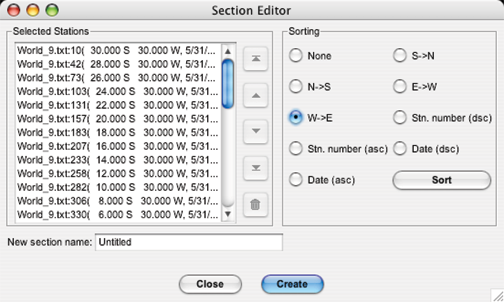

Example 9-14C: Extracting Data Subsets from Map Plots & Advanced JOA Tools for Working with Basin-Scale Data Sets
=================================================================================================================
If you have worked through these DPO JOA Examples using Java OceanAtlas, you now have most of the tools you need to use JOA to view and explore seawater properties in each ocean yourself. There are, however, a few useful JOA map tools that have not yet been introduced.

Java OceanAtlas map plots include features that permit the user to extract station subsets or new sections using a set of graphical tools. These tools complement the Station Filters available via the Filters menu.

For the following exercises we will be using the WOA09 file associated with the Atlantic Ocean, but the exercises can be repeated using any basin.

Files that may be needed or created in this example:

* WOA05_atlantic.jos

Exercise IntroC-01: Map Plots - How-to: Extracting Data Subsets
---------------------------------------------------------------
* Start JOA
* **File → Open** → WOA05_atlantic.jos
* Click **OK** in the import dialog box
* Make a Lambert **Azimuthal Equal Area** Map Plot (refer to :ref:`4B-02`) with the following choices in the **iso-surface value** box in the **Station Colors** window of the **Configure Map Plot** dialog box:

  * *O2* selected for **Parameter**
  * O2\__-global_cbr.xml colorbar
  * PRES-0-6000_srf.xml interpolation surface

  .. figure:: figures/fig9c-01.png

    Fig 9c-01 A map plot

Now we can create subsets using the four icons in the upper left of a Java OceanAtlas map plot:

* The pointer-arrow tool (left-most button) is used to zoom a map to a new range or create a new map window of the selected range.

  .. note::

    Using this tool to select a sub-area of a Java OceanAtlas map plot will create a subset of the main map itself, not a filtered subset of the data used to make the map.

* The pointed-finger tool (2nd button from left) is used to select stations on the map. Using it does not change the latitude/longitude limits of the map. This tool operates in two modes:

  * Dragging a selection region around a set of stations in a map plot will display that subset in the Section Editor window (see below). By leaving the Section Editor window open and repeating selections, additional sub-areas of stations can be selected. New selections will also be displayed in the Section Editor window.
  * As a single station selection tool it can be clicked on any given station symbol, which will then show up in the Section Editor window (see below). By leaving the Section Editor window open, additional stations can be selected by holding down the shift key when clicking on a station symbol.

* The narrow divided-rectangle (3rd button from left) is the section selection tool: First, if needed, type in a new Section width. The section width is the swath width of the tool--stations that fall within the tool's boundary will be selected. The default of 200 km is useful mostly for large basin-scale sections. Often a smaller width is desired. (Experience will show what swath width works best for a given data set.) Section selections are made using the following steps:

  * Click once at the beginning of the desired section.
  * Drag the mouse to enclose the stations to be part of the sections. (Extra stations or duplicates can be discarded later.)

    .. note::

      The width of the section band on the screen may change according to latitude and the map projection.
  
  * Click the mouse to end a section segment and begin a new segment.
  * Double-click to end section selection.

* The irregular-area (polygon) selection tool (4th button from left) works somewhat like the section tool. Polygon selections are made using the following steps:

  * Click once to start the first side of the polygon
  * Drag the mouse to enclose the stations to be part of the selection. (Extra stations or duplicates can be discarded later.)
  * Click the mouse to end a side and begin a new side
  * Double-click to end polygon selection.

The result of successful applications of choice 2, 3, or 4 above should be the Section Editor window popping up:

  Fig 9c-02 A Section Editor

In the Section Editor window, Java OceanAtlas presents a list of all the stations it found inside the selection(s) or along the section track. We will learn about editing this list in the following exercise, and apply these methods in Example Intro-D.

.. note::
  Java OceanAtlas does not pre-sort the selected stations - the list presents the stations as they are found in the data file(s). In addition, the list may include unwanted or duplicate stations.

Exercise IntroC-02: Map Plots - How-to: Editing Data Subsets
------------------------------------------------------------
The list can be edited in two ways:

* Individual stations can be moved or deleted in the list
* The entire list of stations can be sorted by location, station number, or date

To move or delete stations in the **Section Editor**:

* From the station list under **Selected Stations**:

  * click - individual station
  * shift-click - adjacent groups of stations
  * [ctrl/cmd]-click - individual stations or groups of non-adjacent stations

* Use the five buttons to the immediate right of the station list to:

  * |editor-1| Move to the top of the list
  * |editor-2| Move up one step (per click) in the list
  * |editor-3| Move down one step (per click) in the list 
  * |editor-4| Move to the bottom of the list
  * |editor-5| Discard

To sort a list of stations in the **Section Editor**:

* Under **Sorting** select a radial button:

  * **None** (default) - No sorting, keeps the order in which the stations are found in the data file
  * **S→N** - By location South to North
  * **N→S** - By location North to South
  * **E→W** - By location East to West
  * **W→E** - By location West to East
  * **Stn. number (dsc)** - By station number highest to lowest
  * **Stn. number (asc)** - By station number lowest to highest
  * **Date (dsc)** - By date later to earlier
  * **Date (asc)** - earlier to later

* Click **Sort**

For both methods:

* When you are ready to create the new section, type in a name for the new section.
* Click **Create**

The Data Window for the new section should appear, ready for plotting just like the original.

* **File → Save As…** to create a new data file of the newly created subset

We will apply these techniques in Example Intro-D.

.. subs to make inline images work:

.. |editor-1| image:: imgs/editor-1.png
.. |editor-2| image:: imgs/editor-2.png
.. |editor-3| image:: imgs/editor-3.png
.. |editor-4| image:: imgs/editor-4.png
