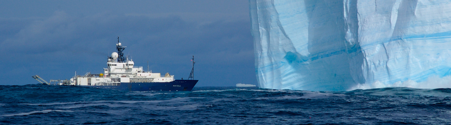

.. Descriptive Physical Oceanography JOA Examples documentation master file, created by
   sphinx-quickstart on Fri Jul 30 12:17:10 2021.
   You can adapt this file completely to your liking, but it should at least
   contain the root `toctree` directive.

Descriptive Physical Oceanography JOA Examples
==============================================

   The oceanographic research vessel Roger Revelle (UCSD Scripps Institution of Oceanography) off Antarctica.

.. toctree::
   :glob:
   :maxdepth: 2
   :caption: Contents:

   */index
   glossary